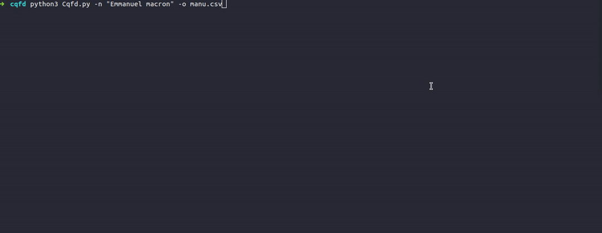

# cqfd
# Educational purposes only
### If you have any suggestions, please do not hesitate to contact us. 
cqfd is a tool and a python libraries to search skype account from a name  

[](https://www.python.org/)
### Demo

## Project example : [cqfd Maltego](https://github.com/megadose/cqfd-maltego)

## 💡 Prerequisite
   [Python 2/3](https://www.python.org/downloads/release/python-370/)
## 🛠️ Installation
### With PyPI
```pip3 install cqfd```
### With Github
```bash
git clone https://github.com/megadose/cqfd.git
cd cqfd/
python3 setup.py install
```
## 📈 Usage
```python
from cqfd import *
print(cqfd("Emmanuel Macron"))
```
## 📚 Example with Cqfd.py
```bash
python3 Cqfd.py -n "Emmanuel Macron" -o emmanuel.csv
```
## 📝 License
[GNU General Public License v3.0](https://www.gnu.org/licenses/gpl-3.0.fr.html)
